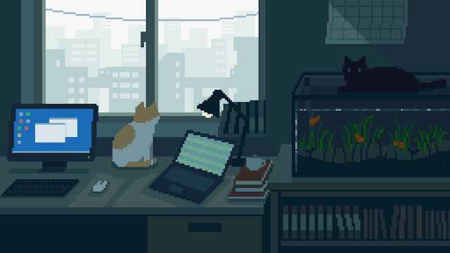

## Miguel Neto - Desenvolvedor Full Stack 

  *No momento sou um Desenvolvedor Full Stack Freelancer procurando novas oportunidades. Aprendo rápido e estou sempre em busca de expandir meus conhecimentos e habilidades. Trabalho em equipe e estou animado para trabalhar com outras pessoas para criar aplicações incríveis.*

 *Estou aprendendo...*
- 📱 Desenvolvimento Mobile
- 🦀 Rust

 *No meu dia a dia, eu uso...*

>

Você pode conferir muito mais informações [no meu site!](https://miguelnto.vercel.app)
